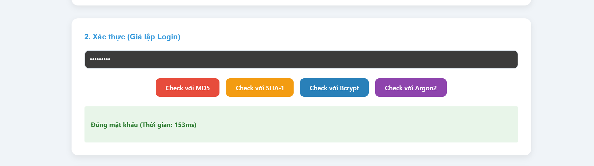
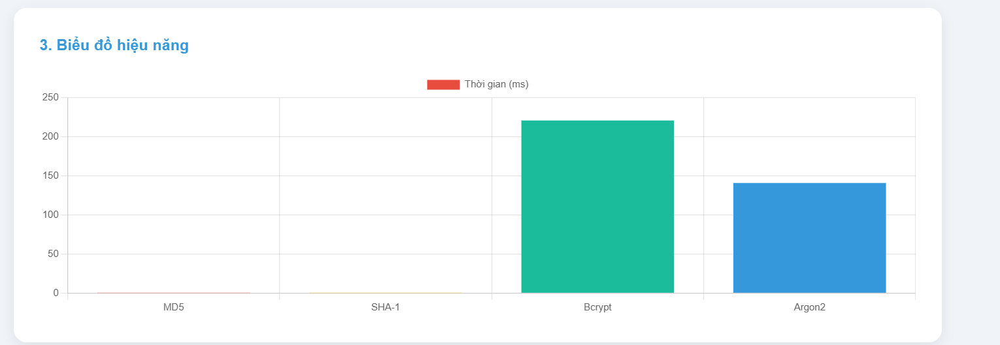
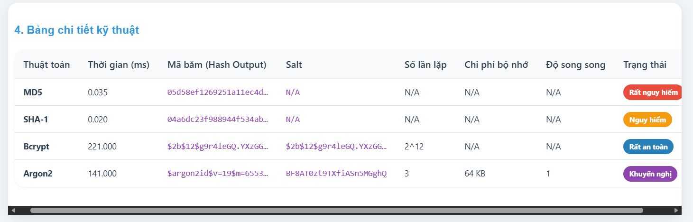
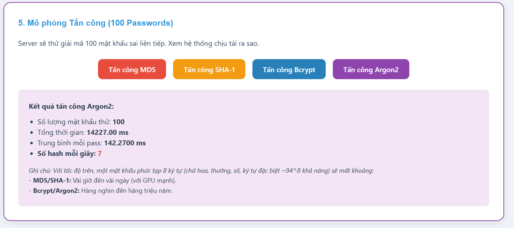

## I. DANH SÁCH THÀNH VIÊN NHÓM

| STT | Họ và tên         | Mã sinh viên |
| :-: | ----------------- | ------------ |
|  1  | Nguyễn Cao Nguyên | 22810310056  |
|  2  | Nguyễn Quang Huy  | 22810310051  |

---

## II. PHÂN CHIA CÔNG VIỆC

**Nguyễn Cao Nguyên** - Xây dựng Backend (Server, API, logic xử lý). - Tích hợp và xử lý các thuật toán hash (MD5, SHA-1, Bcrypt, Argon2). - Thiết kế cơ sở dữ liệu MongoDB.
**Nguyễn Quang Huy** - Xây dựng giao diện người dùng (Frontend). - Thiết kế UI/UX cho các chức năng. - Tích hợp API từ Backend để hiển thị dữ liệu.

## III. HƯỚNG DẪN SỬ DỤNG

Ứng dụng được xây dựng để trực quan hóa sự khác biệt về tốc độ và độ an toàn giữa các thuật toán hash mật khẩu.

### Chức năng 1: Benchmark - Đo lường hiệu năng

Chức năng này cho phép người dùng nhập một mật khẩu và đo thời gian cần thiết để hash mật khẩu đó bằng 4 thuật toán: MD5, SHA-1, Bcrypt, và Argon2.

1.  Nhập một mật khẩu bất kỳ vào ô **"Password"**.
2.  Nhấn nút **"Chạy và Lưu DB"**.
3.  Kết quả sẽ hiển thị thời gian thực thi, chuỗi hash, và các thông số an toàn của từng thuật toán.

**(Ảnh chụp màn hình kết quả Benchmark)**





## IV. HƯỚNG DẪN CÀI ĐẶT VÀ CHẠY DỰ ÁN

### Yêu cầu

- Node.js (phiên bản 14.x trở lên)
- npm
- MongoDB (đã được cài đặt và đang chạy)

### 1. Cài đặt và Khởi chạy Backend

Mở một cửa sổ terminal:

```bash
# Di chuyển vào thư mục Backend
cd BE

# Cài đặt các gói phụ thuộc
npm install

# Khởi chạy server
node server.js
```

Server sẽ lắng nghe ở cổng `3000`.

### 2. Cài đặt và Khởi chạy Frontend

Mở một cửa sổ terminal **khác**:

```bash
# Di chuyển vào thư mục Frontend
cd FE

# Cài đặt các gói phụ thuộc
npm install

# Khởi chạy ứng dụng React
npm run dev
```

Ứng dụng sẽ tự động mở trong trình duyệt của bạn tại địa chỉ `http://localhost:3001` (hoặc một cổng khác nếu 3001 đã được sử dụng).
